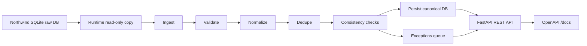

# Northwind Canonical Orders Pipeline

Servicio pequeño para ingerir órdenes desde Northwind SQLite, transformarlas a un modelo canónico propio, correr un pipeline reproducible, persistir resultados en una base versionada y exponer una API para revisión.

## Qué es / problema / usuarios

Este proyecto implementa un pipeline de procesamiento de órdenes usando Northwind SQLite como sistema fuente. La fuente se trata como una referencia fija e inmutable: se descarga, se verifica, se copia a runtime y se lee sin modificarla.

El usuario principal es un revisor técnico que necesita comprobar cómo se modelan datos de negocio, cómo se implementa un pipeline reproducible, cómo se persisten resultados con esquema versionado y cómo se consultan órdenes procesadas, excepciones e ingestas de forma usable.

## Arquitectura



Pipeline implementado:

```text
ingest → validate → normalize → dedupe → consistency-checks → persist → serve/query
```

Tecnologías principales:

- Python
- FastAPI
- SQLite
- Pydantic
- pytest
- Docker Compose
- Migraciones SQL versionadas
- Logs estructurados JSON

## Fuente Northwind + verificación

La fuente obligatoria es una referencia fija de Northwind SQLite:

```text
https://raw.githubusercontent.com/jpwhite3/northwind-SQLite3/4f56e7f5906dfd23b25244c5bfe8fb5da6402efd/dist/northwind.db
```

Comandos:

```bash
./scripts/download_northwind.sh
./scripts/verify_northwind.sh
```

Archivo esperado:

- Tamaño aproximado: 24 MB
- Tamaño observado: 24,702,976 bytes
- SHA-256: `2f4f5c68dfcd33ba27373eae48c7a4869800c68095ee0f9f0da494f83382a877`

El archivo `data/raw/northwind.db` se trata como fuente inmutable y no se sube al repositorio. En runtime se copia a `data/runtime/northwind.db` y la aplicación persiste resultados en una base propia separada: `data/app/app.db`.

## Quickstart

Requisitos:

- Docker
- Docker Compose

Crear `.env` local:

```bash
cp .env.example .env
```

Descargar y verificar Northwind:

```bash
./scripts/download_northwind.sh
```

Levantar el proyecto:

```bash
docker compose up --build
```

La API queda disponible en:

```text
http://localhost:8000
```

OpenAPI:

```text
http://localhost:8000/docs
```

Healthcheck público:

```bash
curl http://localhost:8000/health
```

Disparar una ingesta:

```bash
curl -X POST \
  -H "X-API-Key: dev-api-key" \
  "http://localhost:8000/ingestions"
```

Probar idempotencia ejecutando dos veces:

```bash
curl -X POST \
  -H "X-API-Key: dev-api-key" \
  "http://localhost:8000/ingestions?limit=10"

curl -X POST \
  -H "X-API-Key: dev-api-key" \
  "http://localhost:8000/ingestions?limit=10"
```

La segunda corrida debe marcar las órdenes como `skipped` y no duplicarlas.

## Configuración

Variables principales documentadas en `.env.example`:

```env
APP_ENV=local
API_KEY=dev-api-key

NORTHWIND_URL=https://raw.githubusercontent.com/jpwhite3/northwind-SQLite3/4f56e7f5906dfd23b25244c5bfe8fb5da6402efd/dist/northwind.db

RAW_DB_PATH=data/raw/northwind.db
RUNTIME_DB_PATH=data/runtime/northwind.db
APP_DB_PATH=data/app/app.db
```

No se deben subir secretos ni `.env` al repositorio.

## Modelo canónico

El pipeline transforma los datos crudos de Northwind en un modelo canónico propio compuesto por `CanonicalOrder` y `CanonicalOrderLine`.

Ejemplo:

```json
{
  "natural_key": "northwind:10248",
  "source_order_id": 10248,
  "customer_id": "VINET",
  "customer_name": "Vins et alcools Chevalier",
  "order_date": "1996-07-04",
  "required_date": "1996-08-01",
  "shipped_date": "1996-07-16",
  "status": "shipped",
  "currency": "USD",
  "freight_amount": "32.38",
  "subtotal_amount": "266.00",
  "discount_amount": "0.00",
  "total_amount": "298.38",
  "lines": [
    {
      "natural_line_key": "northwind:10248:11",
      "product_id": 11,
      "product_name": "Queso Cabrales",
      "quantity": 12,
      "unit_price": "14.00",
      "discount_rate": "0.00",
      "line_subtotal": "168.00",
      "line_discount": "0.00",
      "line_total": "168.00"
    }
  ]
}
```

Decisiones de modelado:

- Se usa `Decimal` para montos.
- Se usa `date` para fechas.
- Se usa `Enum` para estados.
- La moneda se fija como `USD` porque Northwind no provee moneda explícita.
- `freight_amount` vive a nivel orden y no en líneas.
- `status` se deriva de `shipped_date`.
- El total canónico se calcula como suma neta de líneas más flete.

## Pipeline

### 1. Ingest

Lee datos desde Northwind SQLite:

- `Orders`
- `Order Details`
- `Customers`
- `Products`
- `Shippers`

El archivo fuente no se muta. La aplicación trabaja sobre una copia runtime en modo lectura.

### 2. Validate

Valida estructura mínima y restricciones básicas del modelo.

Ejemplos:

- La orden debe tener líneas.
- Las cantidades deben ser positivas.
- Los descuentos deben estar entre `0` y `1`.
- Los montos no deben ser negativos.

### 3. Normalize

Convierte filas crudas de Northwind al modelo canónico propio.

Ejemplos:

- `OrderID` → `source_order_id`
- `northwind:{OrderID}` → `natural_key`
- `northwind:{OrderID}:{ProductID}` → `natural_line_key`
- Fechas string → `date`
- Montos numéricos → `Decimal`

### 4. Dedupe

Calcula un `content_hash` SHA-256 del JSON canónico ordenado.

Dentro de una misma corrida:

- Duplicado exacto: se conserva el primero.
- Misma `natural_key` con distinto contenido: se envía a excepciones.

### 5. Consistency checks

Corre reglas de negocio no triviales.

### 6. Persist

Persiste órdenes confirmadas, líneas, excepciones y corridas de ingesta en la base propia.

### 7. Serve/query

Expone API REST con OpenAPI para consultar órdenes, excepciones y corridas.

## Reglas de negocio

El proyecto implementa reglas de negocio y tests unitarios asociados.

Reglas principales:

1. `required_date` no puede ser anterior a `order_date`.
2. `shipped_date` no puede ser anterior a `order_date`.
3. `discount_rate` debe estar entre `0` y `1`.
4. Descuentos mayores a `50%` se consideran anomalía revisable.
5. `freight_amount` no puede ser negativo.
6. Flete mayor al `50%` del total neto de ítems se considera anomalía operativa revisable.
7. Los totales de línea se calculan de forma determinística:
   - `line_subtotal = unit_price * quantity`
   - `line_discount = line_subtotal * discount_rate`
   - `line_total = line_subtotal - line_discount`

Las órdenes con inconsistencias de negocio no se persisten como confirmadas; se envían a la cola de excepciones con motivo.

## Idempotencia y deduplicación

La clave natural de una orden se define como:

```text
northwind:{OrderID}
```

Para cada orden normalizada se calcula un `content_hash` SHA-256 a partir del JSON canónico ordenado.

Estrategia:

- `natural_key` nueva: insertar.
- `natural_key` existente con mismo `content_hash`: omitir como ya procesada.
- `natural_key` existente con distinto `content_hash`: actualizar dentro de una transacción.

Ejemplo de verificación:

```bash
curl -X POST \
  -H "X-API-Key: dev-api-key" \
  "http://localhost:8000/ingestions?limit=10"

curl -X POST \
  -H "X-API-Key: dev-api-key" \
  "http://localhost:8000/ingestions?limit=10"
```

Resultado esperado:

- Primera corrida: `inserted_count = 10`
- Segunda corrida: `skipped_count = 10`
- El número total de órdenes persistidas no aumenta.

## Persistencia y migraciones

La aplicación persiste los resultados en una base SQLite propia: `data/app/app.db`.

Tablas principales:

- `schema_migrations`
- `ingestion_runs`
- `canonical_orders`
- `canonical_order_lines`
- `order_exceptions`

Las migraciones viven en:

```text
migrations/
```

La tabla `schema_migrations` registra qué migraciones fueron aplicadas. Al iniciar la app, se ejecutan las migraciones pendientes en orden.

## API

La API expone una superficie read-only para revisión y un endpoint controlado para disparar reingestas.

Todos los endpoints, excepto `/health`, requieren:

```bash
X-API-Key: dev-api-key
```

Endpoints principales:

| Método | Path | Descripción |
|---|---|---|
| GET | `/health` | Healthcheck público |
| POST | `/ingestions` | Dispara una corrida de ingesta |
| GET | `/ingestion-runs` | Lista corridas de ingesta |
| GET | `/orders` | Lista órdenes canónicas procesadas |
| GET | `/orders/{natural_key}` | Obtiene una orden con sus líneas |
| GET | `/exceptions` | Lista excepciones detectadas |
| GET | `/docs` | OpenAPI interactivo |

Ejemplos:

```bash
curl -X POST \
  -H "X-API-Key: dev-api-key" \
  "http://localhost:8000/ingestions?limit=10"
```

```bash
curl -H "X-API-Key: dev-api-key" \
  "http://localhost:8000/orders?limit=5"
```

```bash
curl -H "X-API-Key: dev-api-key" \
  "http://localhost:8000/orders/northwind:10248"
```

```bash
curl -H "X-API-Key: dev-api-key" \
  "http://localhost:8000/exceptions"
```

```bash
curl -H "X-API-Key: dev-api-key" \
  "http://localhost:8000/ingestion-runs"
```

## Logs estructurados

El servicio emite logs en formato JSON por stdout. Cada corrida de ingesta genera un `correlation_id` que se propaga por las etapas principales del pipeline:

- `ingest`
- `normalize`
- `dedupe`
- `consistency-checks`
- `persist`

Ejemplo:

```json
{
  "event": "pipeline_stage_completed",
  "correlation_id": "9ef...",
  "stage": "dedupe",
  "input_count": 10,
  "output_count": 10,
  "exception_count": 0
}
```

Ver logs con Docker:

```bash
docker compose logs api --tail=50
```

## Tests

El proyecto incluye tests unitarios y de integración.

Unitarios:

- Modelo canónico.
- Normalización.
- Reglas de negocio.
- Deduplicación y hashing.

Integración/e2e:

- Ingesta desde Northwind.
- Persistencia en base canónica.
- Idempotencia al correr la misma ingesta dos veces.
- Endpoints principales.
- Autenticación por API key.

Ejecutar tests:

```bash
pytest
```

Caso clave cubierto:

```text
Ejecutar la misma ingesta dos veces no duplica órdenes confirmadas. La segunda corrida marca las órdenes como skipped.
```

## Decisiones + supuestos

- Northwind se trata como sistema fuente inmutable.
- El archivo fuente se descarga en `data/raw/northwind.db`, se copia a runtime y no se usa como base mutable.
- La clave natural de orden es `northwind:{OrderID}`.
- La clave natural de línea es `northwind:{OrderID}:{ProductID}`.
- Se usa `Decimal` para montos y se normaliza a dos decimales.
- Se usa `date` para fechas.
- Northwind contiene fechas en formatos `date` y `datetime`; el modelo canónico conserva solo la fecha porque el dominio pedido es Orden/Línea y no requiere granularidad horaria.
- La moneda se fija como `USD` porque Northwind no provee moneda explícita.
- `freight_amount` se modela como cargo a nivel orden y no se distribuye entre líneas.
- `status` se deriva de `shipped_date`.
- Las órdenes con inconsistencias de negocio no se persisten como confirmadas; se envían a la cola de excepciones.
- Se considera anomalía revisable cuando el flete supera el `50%` del total neto de ítems. No implica corrupción de datos, pero se expone como excepción operacional porque Northwind no provee reglas logísticas explícitas.

## Limitaciones

- La API key es simple y está pensada para entorno local/revisión, no para producción.
- No hay rate limiting.
- No hay paginación avanzada con cursores; se usa `limit` y `offset`.
- No hay UI; la superficie usable es REST + OpenAPI.
- La moneda se asume como `USD` porque la fuente no trae moneda explícita.
- La clasificación de algunas anomalías operativas, como flete alto, es heurística y está documentada como supuesto.
- SQLite es suficiente para el alcance del ejercicio; en producción podría migrarse a Postgres.

## Threat model breve

- Autenticación: los endpoints principales requieren `X-API-Key`.
- Secretos: `.env` no se sube al repositorio; `.env.example` documenta las variables necesarias.
- Abuso: `POST /ingestions` puede ser costoso si se dispara repetidamente; en producción se agregaría rate limiting o control de jobs.
- Datos: la API es read-only salvo `POST /ingestions`, que dispara un proceso idempotente.
- Integridad de fuente: el archivo Northwind se verifica y no se muta.
- Integridad de persistencia: las escrituras se hacen contra la base canónica propia y usando claves naturales únicas.
- Observabilidad: cada corrida genera logs JSON con `correlation_id`.

## Uso de IA

Usé IA como apoyo para:

- estructurar el plan de implementación;
- revisar el diseño del README;
- generar ideas de reglas de negocio y tests;
- mejorar redacción de decisiones, supuestos y limitaciones;
- revisar mensajes de error durante el desarrollo.

Validé manualmente:

- el modelo canónico;
- la estrategia de idempotencia;
- el comportamiento de las migraciones;
- la lectura de Northwind sin mutar la fuente;
- los endpoints principales;
- los resultados de tests;
- que `docker compose up --build` levante el proyecto;
- que la reingesta no duplique órdenes confirmadas.